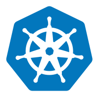

# Key Features of Kubernetes

- **Automated Rollouts and Rollbacks**: Kubernetes can automatically roll out changes to your application or its configuration while monitoring the application's health to ensure it doesn't kill all your instances at once.
- **Service Discovery and Load Balancing**: Kubernetes can expose a container using the DNS name or using their own IP address. If traffic to a container is high, Kubernetes can load balance and distribute the network traffic so that the deployment is stable.
- **Storage Orchestration**: Kubernetes allows you to automatically mount the storage system of your choice, whether from local storage, a public cloud provider, or a network storage system.
- **Self-Healing**: Kubernetes restarts containers that fail, replaces containers, kills containers that don't respond to your user-defined health check, and doesn't advertise them to clients until they are ready to serve.
- **Secret and Configuration Management**: Kubernetes lets you store and manage sensitive information, such as passwords, OAuth tokens, and ssh keys. You can deploy and update secrets and application configuration without rebuilding your container images, and without exposing secrets in your stack configuration. 
- **Horizontal Scaling**: You can scale your application up and down with a simple command, with a UI, or automatically based on CPU usage.
- **Batch Execution**: In addition to services, Kubernetes can manage your batch and CI workloads, replacing containers that fail, if desired.
- **Extensibility and Pluggability**: Kubernetes is highly extensible and can be customized to fit the needs of different applications and environments through custom resources and controllers.
- **Multi-Cloud and Hybrid Deployments**: Kubernetes can run on various environments, including on-premises, public clouds, or hybrid setups, providing flexibility in deployment strategies.
- **Open Source**: Kubernetes is open source and available under the Apache License 2.0.
- **Vibrant Ecosystem**: Kubernetes has a large and active community, with many third-party tools and extensions available to enhance its functionality.    
- **Declarative Configuration**: Kubernetes uses declarative configuration files (YAML or JSON) to define the desired state of the system, making it easier to manage and version control infrastructure as code.
- **Resource Management**: Kubernetes efficiently manages resources by allocating CPU and memory to containers based on their requirements, ensuring optimal utilization of cluster resources.
- **Namespaces**: Kubernetes supports namespaces, which allow you to create multiple virtual clusters within a single physical cluster, providing isolation and organization for different teams or projects.
- **Monitoring and Logging**: Kubernetes integrates with various monitoring and logging tools, enabling you to track the performance and health of your applications and infrastructure.
- **Security**: Kubernetes provides a wide range of security features, including authentication, authorization, and encryption, to protect your data and applications from unauthorized access.
- **Community and Ecosystem**: Kubernetes has a large and active community, with many third-party tools and extensions available to enhance its functionality.
- **API-Driven**: Kubernetes is built around a powerful API that allows for automation and integration with other systems and tools.
- **Declarative Infrastructure**: Kubernetes allows you to define your infrastructure as code, making it easier to manage and version control your deployments.
- **Rolling Updates**: Kubernetes supports rolling updates, allowing you to update your applications without downtime by gradually replacing old versions with new ones.
- **Health Checks**: Kubernetes provides built-in health checks (liveness and readiness probes) to monitor the health of your applications and ensure they are running as expected.
- **Custom Resource Definitions (CRDs)**: Kubernetes allows you to extend its functionality by defining your own custom resources, enabling you to manage additional types of objects within the cluster.
- **Operator Pattern**: Kubernetes supports the operator pattern, which allows you to automate the management of complex applications by encapsulating operational knowledge into custom controllers.
- **Event-Driven Architecture**: Kubernetes supports event-driven architectures, allowing you to build applications that respond to changes in the environment or other triggers.
- **Multi-Tenancy**: Kubernetes supports multi-tenancy, allowing multiple users or teams to share a single cluster while maintaining isolation and security between them.  
- **Cloud-Native**: Kubernetes is designed for cloud-native applications, making it easier to build, deploy, and manage applications that are optimized for cloud environments.
- **Service Mesh Integration**: Kubernetes can integrate with service mesh technologies like Istio and Linkerd, providing advanced networking features such as traffic management, security, and observability for microservices architectures.
- **GitOps Support**: Kubernetes supports GitOps practices, allowing you to manage your infrastructure and application deployments using Git repositories as the source of truth, enabling version control, collaboration, and automated deployments.
- **Edge Computing Support**: Kubernetes can be deployed in edge computing environments, enabling the management of applications and services closer to the data source, reducing latency and improving performance for edge use cases.
- **Serverless Frameworks**: Kubernetes can work with serverless frameworks like Knative, allowing you to build and deploy serverless applications that can scale automatically based on demand.
- **AI/ML Workloads**: Kubernetes can be used to manage AI/ML workloads, providing a scalable and flexible platform for training and deploying machine learning models using tools like Kubeflow and TensorFlow Serving.
- **IoT Integration**: Kubernetes can be integrated with IoT platforms, enabling the management of IoT applications and services that require scalability, reliability, and efficient resource utilization.
- **Hybrid Cloud Deployments**: Kubernetes supports hybrid cloud deployments, allowing you to run applications across multiple cloud providers and on-premises environments, providing flexibility and avoiding vendor lock-in.
- **Cost Optimization**: Kubernetes can help optimize costs by efficiently utilizing resources, enabling autoscaling, and allowing for the use of spot instances or preemptible VMs in cloud environments.
- **Compliance and Governance**: Kubernetes provides features that help organizations meet compliance and governance requirements, such as role-based access control (RBAC), audit logging, and policy enforcement through tools like Open Policy Agent (OPA) and Kyverno.
- **Developer Productivity**: Kubernetes enhances developer productivity by providing a consistent and standardized platform for building, testing, and deploying applications, enabling faster development cycles and easier collaboration among teams.
- **Ecosystem Integration**: Kubernetes integrates with a wide range of tools and platforms in the cloud-native ecosystem, including CI/CD pipelines, monitoring solutions, logging systems, and security tools, enabling seamless workflows and enhanced functionality.
- **Future-Proofing**: Kubernetes is continuously evolving, with a strong community and industry support, ensuring that it remains relevant and capable of meeting the needs of modern applications and infrastructure in the future.
- **Extensive Documentation and Learning Resources**: Kubernetes has comprehensive documentation and a wealth of learning resources available, including tutorials, courses, and community forums, making it easier for users to get started and deepen their understanding of the platform.    
- **Wide Adoption and Industry Support**: Kubernetes is widely adopted by organizations of all sizes and has strong support from major cloud providers, ensuring its longevity and continued development in the industry.   
- **Rich Set of Built-in Controllers**: Kubernetes comes with a variety of built-in controllers that manage different aspects of the cluster, such as ReplicaSets for maintaining the desired number of pod replicas, Deployments for managing application updates, and StatefulSets for stateful applications.
- **Advanced Networking Capabilities**: Kubernetes offers advanced networking features, including network policies for controlling traffic between pods, support for multiple network plugins (CNI), and integration with service meshes for enhanced communication between microservices.
- **Extensive API Ecosystem**: Kubernetes has a rich API ecosystem that allows developers to build custom tools and integrations, enabling automation and extending the platform's capabilities to meet specific use cases.
- **Robust Scheduling Mechanism**: Kubernetes includes a sophisticated scheduling mechanism that efficiently allocates resources to pods based on their requirements, priorities, and constraints, ensuring optimal performance and resource utilization across the cluster.
- **Multi-Cluster Management**: Kubernetes can manage multiple clusters, allowing you to run different applications and services in different environments, providing scalability and isolation.
- **Multi-User Management**: Kubernetes supports multi-user management, enabling you to manage different teams or projects within a single cluster, providing isolation and security.   
- **Extensive Tooling and Integrations**: Kubernetes has a vast ecosystem of tools and integrations that enhance its functionality, including monitoring solutions like Prometheus, logging tools like Fluentd, and CI/CD platforms like Jenkins and Argo CD.
- **Strong Community Support**: Kubernetes has a large and active community of users and contributors who provide support, share knowledge, and contribute to the platform's development, ensuring its continued growth and improvement.
- **Regular Updates and Improvements**: Kubernetes is continuously updated with new features, bug fixes, and security patches, ensuring that it remains a cutting-edge platform for container orchestration.
- **Vendor-Neutral**: Kubernetes is a vendor-neutral platform, allowing you to choose the best tools and services for your needs without being locked into a specific vendor's ecosystem.
- **Comprehensive Ecosystem of Add-Ons**: Kubernetes has a rich ecosystem of add-ons and extensions that provide additional functionality, such as monitoring, logging, security, and networking enhancements, allowing you to tailor the platform to your specific requirements.
- **Strong Focus on Security**: Kubernetes has a strong focus on security, with features like role-based access control (RBAC), network policies, and secrets management, helping you secure your applications and data in the cluster.
- **Wide Range of Use Cases**: Kubernetes can be used for a wide range of use cases, including web applications, microservices, big data processing, machine learning, and more, making it a versatile platform for modern application development and deployment.
- **Support for Stateful Applications**: Kubernetes provides support for stateful applications through StatefulSets, which manage the deployment and scaling of stateful applications while maintaining their identity and persistent storage.  
- **Extensive Certification Programs**: Kubernetes offers certification programs, such as the Certified Kubernetes Administrator (CKA) and Certified Kubernetes Application Developer (CKAD), which help professionals validate their skills and knowledge in managing and developing applications on Kubernetes.
