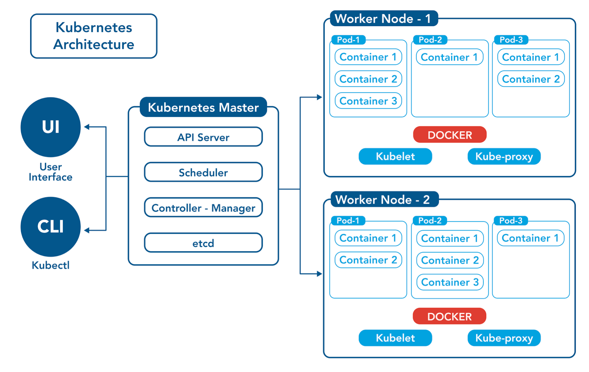

# Getting Started with Kubernetes

## What is Kubernetes?
Kubernetes, often abbreviated as K8s, is an open-source **container orchestration** platform designed to **automate the deployment, scaling, and management of containerized applications**. It was originally developed by Google and is now **maintained by the Cloud Native Computing Foundation (CNCF)**. Kubernetes provides a robust framework for running **distributed systems** resiliently, allowing for scaling and failover for applications, as well as providing deployment patterns. 

