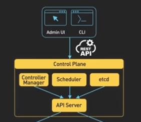

# Kubernetes Explained in 6 Minutes | k8s Architecture 
Watch https://www.youtube.com/watch?v=TlHvYWVUZyc
ByteByteGo Channel: https://www.youtube.com/@ByteByteGo

## What is Kubernetes?
Kubernetes is an open-source container orchestration platform. 

It automates the deployment, scaling, and management of containerized applications. I was originally created based on Borg (Proprietary), Google's internal container management system that managed the deployment of thousands of applications within Google's data centers (2003-2004).

Kubernetes is also called K8s (K + 8 letters + s).

A kubernetes cluster is a set of machines called **Nodes** that are used to run containerized applications.

## Core Components of Kubernetes

There are two core pieces in a kubernetes cluster:
- **Control Plane**: The control plane is responsible for managing the overall state of the cluster. In production environments, the control plane usually runs on multiple nodes that span across several data center zones.

- **Worker Nodes**: the second is a set of worker nodes. Theses nodes run the containerized applications workloads. 

  - The containerized applications run inside **Pods**. Pods are the smallest deployable units in Kubernetes and can contain **one or more containers** and **provides shared storage and networking** for those containers. Pods are created and managed by the control plane. Pods are the basic building blocks of Kubernetes applications.

## Explaining the Control Plane
The control plane consists of several components that work together to manage the cluster:

- **API Server**: Is the primary interface between the control plane and the rest of the cluster. It exposes a RESTFul API that allows clients to interact with the control plane and submit requests to manage the cluster.

- **etcd**: etcd is a distributed key-value store that stores all the cluster's persistent state.

- **Scheduler**: The scheduler is responsible for scheduling pods onto worker nodes in the cluster.

- **Controller Manager**: The controller manager is responsible for managing the various controllers that ensure the desired state of the cluster is maintained.

